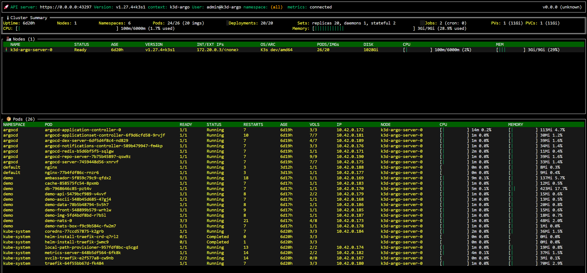

# Розширення kubectl (Extending kubectl)

1. Для виконання задачі розберемось як працює [приклад](https://github.com/vladimirvivien/ktop)
- Оберемо метод встановлення за допомогою вже існуючого в системі go:
```sh
$ go install github.com/vladimirvivien/ktop@latest
$ export PATH="/root/go/bin:$PATH"
$ ktop             
Connected to: https://0.0.0.0:43297
 _    _ 
| | _| |_ ___  _ __
| |/ / __/ _ \| '_ \
|   <| || (_) | |_) |
|_|\_\\__\___/| .__/
              |_|
```



2. Тепер розберемось з механізмом встановлення [плагінів для `kubectl](https://krew.sigs.k8s.io/plugins/)  
```sh
(
  set -x; cd "$(mktemp -d)" &&
  OS="$(uname | tr '[:upper:]' '[:lower:]')" &&
  ARCH="$(uname -m | sed -e 's/x86_64/amd64/' -e 's/\(arm\)\(64\)\?.*/\1\2/' -e 's/aarch64$/arm64/')" &&
  KREW="krew-${OS}_${ARCH}" &&
  curl -fsSLO "https://github.com/kubernetes-sigs/krew/releases/latest/download/${KREW}.tar.gz" &&
  tar zxvf "${KREW}.tar.gz" &&
  ./"${KREW}" install krew
)

$ nano ~/.zshrc

# Add this row: export PATH="${KREW_ROOT:-$HOME/.krew}/bin:$PATH"

$ source ~/.zshrc

$ k krew      
krew is the kubectl plugin manager.
You can invoke krew through kubectl: "kubectl krew [command]..."

Usage:
  kubectl krew [command]

Available Commands:
  help        Help about any command
  index       Manage custom plugin indexes
  info        Show information about an available plugin
  install     Install kubectl plugins
  list        List installed kubectl plugins
  search      Discover kubectl plugins
  uninstall   Uninstall plugins
  update      Update the local copy of the plugin index
  upgrade     Upgrade installed plugins to newer versions
  version     Show krew version and diagnostics

Flags:
  -h, --help      help for krew
  -v, --v Level   number for the log level verbosity

Use "kubectl krew [command] --help" for more information about a command.

# Спробуємо встановити планін ns для перемикання між namespaces
$ k krew install ns
Updated the local copy of plugin index.
Installing plugin: ns
Installed plugin: ns
\
 | Use this plugin:
 |      kubectl ns
 | Documentation:
 |      https://github.com/ahmetb/kubectx
 | Caveats:
 | \
 |  | If fzf is installed on your machine, you can interactively choose
 |  | between the entries using the arrow keys, or by fuzzy searching
 |  | as you type.
 | /
/
WARNING: You installed plugin "ns" from the krew-index plugin repository.
   These plugins are not audited for security by the Krew maintainers.
   Run them at your own risk.

$ k ns             
kube-system
default
kube-public
kube-node-lease
argocd
demo

(⎈|k3d-argo:default)➜  ~ k ns demo
Context "k3d-argo" modified.
Active namespace is "demo".
(⎈|k3d-argo:demo)➜  ~ 

# перевіримо які плагіни зараз встановлені 
$ kubectl plugin list

/root/.krew/bin/kubectl-krew
/root/.krew/bin/kubectl-ns


```
3. Створення початкової моделі з наданого коду
```bash
#!/bin/bash

# Define command-line arguments

RESOURCE_TYPE=$1

# Retrieve resource usage statistics from Kubernetes
kubectl $2 $RESOURCE_TYPE -n $1 | tail -n +2 | while read line
do
  # Extract CPU and memory usage from the output
  NAME=$(echo $line | awk '{print $1}')
  CPU=$(echo $line | awk '{print $2}')
  MEMORY=$(echo $line | awk '{print $3}')

  # Output the statistics to the console
  # "Resource, Namespace, Name, CPU, Memory"
done
```
- отже створимо файл з цим кодом та надамо права на виконання
```sh
$ touch kubeplugin
$ chmod 755 kubeplugin 
$ ls -al kubeplugin   
-rwxr-xr-x 1 root root 444 Dec  2 14:52 kubeplugin
```
- скопіюємо майбутній плагін в директорію до якої відомий шлях в системі за [інструкцією](https://kubernetes.io/docs/tasks/extend-kubectl/kubectl-plugins/)

```sh
$ sudo cp ./kubeplugin /usr/local/bin/kubectl-kubeplugin

$ kubectl plugin list
The following compatible plugins are available:
/root/.krew/bin/kubectl-krew
/root/.krew/bin/kubectl-ns
/usr/local/bin/kubectl-kubeplugin
```

4. Виправлення помилок в крипті
- додамо початковий код на перевірку наявності двох обов'язкових параметрів при запуску скрипту
```sh
if [ "$#" -ne 2 ]; then
    echo "Usage: $0 <node or pod> <namespace>"
    exit 1
fi
```
- визначимо команду з якої будемо отримувати необхідні дані 
```sh
$ k top pod -n kube-system
NAME                                     CPU(cores)   MEMORY(bytes)   
coredns-77ccd57875-k2grb                 2m           32Mi            
local-path-provisioner-957fdf8bc-q5cgd   1m           23Mi            
metrics-server-648b5df564-6fk8k          4m           45Mi            
svclb-traefik-e2f577a8-cw9nb             0m           1Mi             
traefik-64f55bb67d-fk484                 1m           55Mi  
```
- додамо в скрипт вивід потрібних змінних через кому:
```sh
echo "$RESOURCE_TYPE, $NAMESPACE, $NAME, $CPU, $MEMORY"
```

5. Інструкція з використання
Приклади використання:
```sh
$ k kubeplugin pod kube-system
pod, kube-system, coredns-77ccd57875-k2grb, 2m, 32Mi
pod, kube-system, local-path-provisioner-957fdf8bc-q5cgd, 1m, 21Mi
pod, kube-system, metrics-server-648b5df564-6fk8k, 4m, 43Mi
pod, kube-system, svclb-traefik-e2f577a8-cw9nb, 0m, 1Mi
pod, kube-system, traefik-64f55bb67d-fk484, 1m, 51Mi

$ k kubeplugin node kube-system
node, kube-system, k3d-argo-server-0, 98m, 1%
```
